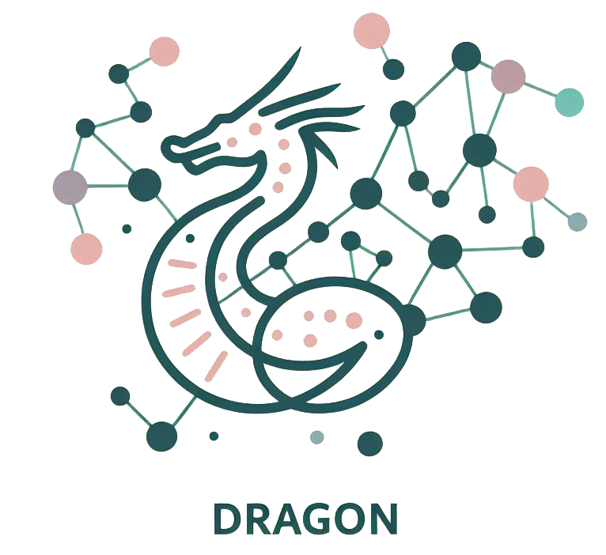

**DRAGON**, for **DiRected Acyclic Graphs OptimizatioN**, is an open source Python package for the optimization of *Deep Neural Networks Hyperparameters and Architecture* [[1]](#1). 
**DRAGON** is not a *no code* package, but you can get familiar with it quickly thanks to the [Documentation](https://dragon-tutorial.readthedocs.io/en/latest/index.html). 

Key Features
------------

- A flexible seach space
     - The search space based on Directed Acyclic Graphs (DAGs) where the nodes can be any **PyTorch** layer (custom or not) and the edges are the connections between them. 
     - The code to implement the DAGs-based search space was inspired by the [zellij](https://zellij.readthedocs.io/en/latest/) package developed for hyperparameters optimization. 
     - **DRAGON** search space includes cell-based search spaces [4]_.
 
- Flexible optimization algorithms
     - The search algorithms defined in **DRAGON** are based on search operators used to modify elements of the search space (e.g., mutations, neighborhoods, crossover), which can be used to develop new search algorithms.
     - Efficient algorithms are also implemented in **DRAGON** such as the Random Search, Evolutionary Algorithm, Mutant UCB, and HyperBand.

- Applications to various tasks
     - The flexibility of **DRAGON** makes it usable for various applications.
     - For example: image classification, time series forecasting, electricity consumption forecasting, wind power forecasting or tabular data.

- Easy parallelization over multiple GPUs
     - The distributed version requires a MPI library, such as [MPICH](https://www.mpich.org/) or [Open MPI](https://www.open-mpi.org/) and is based on [mpi4py](https://mpi4py.readthedocs.io/en/stable/intro.html#what-is-mpi).

Basic Concepts
------------

- The **Search Space** is a mix-variable search space. Numerical, categorical and graph objects may be jointly optimized. Each object is associated with a **variable**, which defines what values an object can take.
- Base on this search space, several **Search Operators** are defined, showing how the objects can be manipulate to find the neighboring values.

Install DRAGON
--------------

**Basic version**

After cloning the git repository, install **DRAGON**, using:

     pip install -e dragon

**Distributed version**

If you plan on using the distributed version, you have to install the mpi4py package:

     pip install mpi4py

**Documentation**

Additional dependencies are required to run the documentation notebooks:

     pip install -e dragon[docs]

Dependencies
------------

* **Python** >=3.9
* [numpy](https://numpy.org/)<2.0.0
* [torch](https://pytorch.org/)
* [graphviz](https://graphviz.org/)
* [pandas](https://pandas.pydata.org/)
* [mpi]: 
    * [mpi4py](https://mpi4py.readthedocs.io/en/stable/)
* [docs]: 
     * [openml](https://www.openml.org/)
     * [sklearn](https://scikit-learn.org)
     * [optuna](https://optuna.org/)
     * [matplotlib](https://matplotlib.org/)
     * [skorch](https://skorch.readthedocs.io/en/stable/)

## Contributors ##
### Design
* Julie Keisler: julie.keisler.rfo@gmail.com
  
## References ##
<a id="1">[1]</a>
Keisler, J., Talbi, E. G., Claudel, S., & Cabriel, G. (2024). An algorithmic framework for the optimization of deep neural networks architectures and hyperparameters. Journal of Machine Learning Research.

